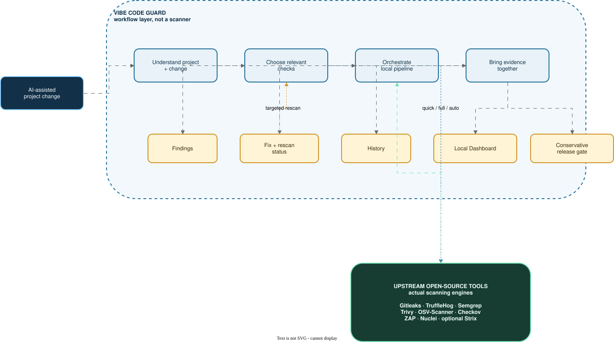

# Vibe Code Guard

**A local-first security workflow for Codex, Claude Code, Gemini CLI, and other AI coding agents.**

`v0.8.0-beta` · Public Beta packaging / Active Development · macOS Apple Silicon validated

AI coding is fast. Security tooling is fragmented.

Vibe Code Guard does not invent a new vulnerability scanning engine. It brings
existing open-source security tools into one local, change-aware pipeline and
Dashboard.

**The scanners find the problems. Vibe Code Guard makes the security workflow
usable.**

<p align="center">
  
</p>

Static fallback: [view the PNG export](diagrams/vibe-code-guard-explainer-next-ai-drawio.png).

## The first-use experience

Vibe Code Guard is for people who build with Codex, Claude Code, Gemini CLI,
Cursor agents, or similar coding agents and want a local security workflow
without learning eight scanner command lines.

Give your coding agent this repository and say:

```text
Install Vibe Code Guard from https://github.com/DOTfei/vibe-code-guard
and security audit this project.
```

The agent should safely plan installation, check the local toolchain, discover
the project, select relevant checks, run the audit, read the structured result,
and show the local Dashboard. The scanners remain independently installed
upstream tools; Vibe Code Guard supplies the safe workflow around them.

If the audit finds a release-blocking issue, the next user prompt can be:

```text
Fix the current release-blocking security issues. Ask before changing code,
then run targeted verification and report the final release status.
```

Agents use CLI/JSON as the machine interface. Humans use the Dashboard as the
visual interface. Both read the same persisted findings, lifecycle,
verification, scanner state, and release gate.

See [`AGENTS.md`](AGENTS.md) and
[`docs/agent-integration.md`](docs/agent-integration.md) for the canonical
agent workflow and JSON contracts.

v0.8 packages a clearer first-screen Dashboard and public-beta onboarding. It
keeps the v0.7 safe real-workflow validation harness using temporary projects and
mock scanner executables. It exercises the same agent-facing install, doctor,
audit, correlation, Dashboard, fix, targeted verification, and release-gate
paths without changing the host toolchain or contacting public targets. See
[`docs/public-beta-readiness.md`](docs/public-beta-readiness.md) and the
[`v0.7 friction log`](docs/e2e-friction-log.md) for the tested boundary and
known limitations. Maintainers can use the [safe public-beta demo](docs/public-beta-demo.md)
to review the Dashboard states without public targets or real credentials.

## What this project is

Vibe Code Guard combines the capabilities of established open-source security
tools into one understandable local workflow for AI-generated and
“vibe-coded” projects.

It is not a new scanner and it does not replace the upstream projects. It is
the layer around them that understands project context, coordinates the checks,
normalizes scanner results into one Unified Finding Schema, and brings findings,
execution state, run history, and the local Dashboard into one workflow.
Cross-tool correlation, persistent finding lifecycle, targeted verification,
and upstream tool lifecycle planning are now included:

1. understands what changed in a repository;
2. classifies the change and applies safe scanning policies;
3. selects the relevant checks instead of blindly running everything every time;
4. executes independently installed upstream tools;
5. collects execution evidence, findings, and skip reasons; and
6. presents the result in a local Dashboard with history and a conservative
   release-gate summary; and
7. stores scanner-independent Unified Findings for the CLI, Dashboard, reports,
   and a project-level correlation and lifecycle index;
8. verifies an authorized external-agent fix with only the relevant scanners;
9. keeps scanner engine updates separate from databases, rules, templates, and
   add-ons, with official-source checks and explicit one-tool update plans.

The goal is simple: install the security toolkit once, then use the same
repeatable security workflow in every AI-assisted coding repository.

## Who does what

| | Responsibility |
| --- | --- |
| **Upstream open-source tools** | Detect vulnerabilities, secrets, insecure code, dependency issues, infrastructure misconfigurations, and authorized web/runtime signals. They provide the actual scanning engines. |
| **Vibe Code Guard** | Understands project and change context; decides which scanners are relevant; orchestrates the pipeline; normalizes results into the v1 Unified Finding Schema; correlates compatible evidence; tracks explicit fix and verification lifecycle; performs targeted verification without editing code; records execution state and run history; presents the local Dashboard and reports; and provides a conservative release gate. |

Vibe Code Guard does not claim the upstream detection engines as its own work.
The individual tools remain responsible for their own scanning behavior and
licenses. Their versions, releases, rules, databases, templates, and add-ons
come from the respective upstream projects; Vibe Code Guard does not own or
guarantee those artifacts and only validates local compatibility and
known-good state where supported.

## The problem we solve

AI-assisted development makes it easy to create features quickly, but it also
creates a practical security gap:

- **Security tools are fragmented.** Each scanner has its own installation,
  command syntax, output format, database, rules, and update process.
- **Developers do not know which check fits the change.** A dependency change,
  API change, secret leak, Dockerfile, and web application need different kinds
  of review.
- **Running every scanner on every edit is slow.** Running none of them leaves
  blind spots.
- **Raw findings are difficult to act on.** A list of tool-specific alerts does
  not clearly show what ran, what was skipped, what matters, or whether a fix
  actually remained fixed.
- **Active testing needs a boundary.** Web scanners and agentic testing tools
  must not accidentally target third-party systems.
- **Toolchain health is easy to forget.** An outdated binary, missing database,
  broken rule set, or failed self-test can make a security workflow look more
  complete than it really is.

Vibe Code Guard turns those separate concerns into one visible, local, and
repeatable security path.

## What we built

### 1. A curated open-source security toolkit

The core toolkit covers several independent detection layers:

| Security layer | Open-source tool | What it contributes | License |
| --- | --- | --- | --- |
| Secrets | [Gitleaks](https://github.com/gitleaks/gitleaks) | Detects likely secrets in source and Git history | [MIT](https://raw.githubusercontent.com/gitleaks/gitleaks/master/LICENSE) |
| Secrets | [TruffleHog](https://github.com/trufflesecurity/trufflehog) | Searches for credentials and verifies exposed secrets where supported | [GNU AGPL v3 — see upstream LICENSE](https://raw.githubusercontent.com/trufflesecurity/trufflehog/main/LICENSE) |
| Static analysis | [Semgrep](https://github.com/semgrep/semgrep) | Finds insecure code patterns using configurable rules | [LGPL-2.1](https://raw.githubusercontent.com/semgrep/semgrep/develop/LICENSE) |
| Vulnerabilities and config | [Trivy](https://github.com/aquasecurity/trivy) | Scans dependencies, filesystems, containers, secrets, and configuration | [Apache-2.0](https://raw.githubusercontent.com/aquasecurity/trivy/main/LICENSE) |
| Dependencies | [OSV-Scanner](https://github.com/google/osv-scanner) | Matches supported dependency manifests and lockfiles to OSV vulnerabilities | [Apache-2.0](https://raw.githubusercontent.com/google/osv-scanner/main/LICENSE) |
| Infrastructure as code | [Checkov](https://github.com/bridgecrewio/checkov) | Checks Terraform, Dockerfiles, Kubernetes, and other IaC policies | [Apache-2.0](https://raw.githubusercontent.com/bridgecrewio/checkov/main/LICENSE) |
| Authorized web testing | [OWASP ZAP](https://github.com/zaproxy/zaproxy) | Dynamic web application testing for authorized local/test targets | [Apache-2.0](https://raw.githubusercontent.com/zaproxy/zaproxy/main/LICENSE) |
| Authorized template detection | [Nuclei](https://github.com/projectdiscovery/nuclei) | Template-driven detection against explicitly authorized targets | [MIT](https://raw.githubusercontent.com/projectdiscovery/nuclei/main/LICENSE.md) |
| Detection content | [Nuclei Templates](https://github.com/projectdiscovery/nuclei-templates) | Community-curated detection content used by Nuclei | [MIT](https://raw.githubusercontent.com/projectdiscovery/nuclei-templates/main/LICENSE.md) |
| Optional agentic testing | [Strix](https://github.com/usestrix/strix) | Explicitly authorized deep testing and exploit validation | [Apache-2.0](https://raw.githubusercontent.com/usestrix/strix/main/LICENSE) |

Strix is not part of the deterministic eight-tool core health gate and is
never invoked implicitly by `quick` or `full`.

This is **composition at the workflow layer**, not a combined binary or a
fork. The repository does not copy, bundle, modify, or redistribute the
upstream scanners, their binaries, databases, rules, templates, or add-ons.
They are independently installed and managed through their own official
channels. This repository does not relicense them or claim them as its own
work.

### 2. A change-aware security pipeline

The pipeline separates everyday development checks from deeper pre-release
review:

```text
repository change
       ↓
detect files, stack, and risk
       ↓
apply policy and choose relevant checks
       ↓
run local upstream scanners
       ↓
parse the current run and explain findings
       ↓
record execution state and run history
       ↓
fix authorized by user → targeted rescan → lifecycle verification
       ↓
human review and conservative release gate
```

The intended operating pattern is:

| Moment | Command | Typical scope |
| --- | --- | --- |
| During development | `vibe-code-guard audit . --profile quick` | Secrets, static analysis, and dependency checks |
| Before release | `vibe-code-guard audit . --profile release` | Broader code, dependency, infrastructure, and authorized runtime checks |
| For a changed project | `vibe-code-guard audit . --profile auto` | Change-aware selection with an explanation for every run or skip |

**Full installation does not mean full scanning on every edit.** The toolkit
can be installed once globally, while the pipeline chooses a proportionate set
of checks for the current change.

### 3. A local security Dashboard

The Dashboard gives developers a visual audit trail instead of forcing them to
read several unrelated terminal outputs. It shows:

- which scanners actually ran;
- installed tool and toolchain health;
- findings and their evidence;
- explicit skip and not-applicable reasons;
- scan history and current run/rescan evidence; and
- a conservative release-gate summary.

The current Dashboard reads the v1 Unified Finding Schema and presents
correlated issues with scanner observations and explicit lifecycle actions. It
does not automatically fix code; after an authorized external-agent fix it can
run a targeted rescan and report `VERIFIED`, `STILL_DETECTED`, or
`VERIFICATION_INCOMPLETE`. See the [Unified
Finding Schema documentation](docs/unified-finding-schema.md) and [correlation
and lifecycle documentation](docs/correlation-and-lifecycle.md) for the field
contracts and compatibility rules.

The Dashboard is local-only by default. It binds to `127.0.0.1`, does not
require an account or cloud database, and does not upload source code or scan
results. It observes and explains scanner execution; it does not manufacture
findings or pretend that a skipped check passed. v0.4 adds an optional,
explicitly triggered AI Security Review that explains selected redacted
Correlated Finding context; it remains advisory and cannot change deterministic
security state. See [AI Security Review documentation](docs/ai-security-review.md).

The Dashboard's first screen answers the human questions first: can this
project be deployed according to the canonical gate, which issues need
attention, whether a fix was actually verified, and whether scanner coverage
is degraded. Technical scanner observations remain available in the Findings
and Toolkit views. A clean result means no current release-blocking findings
were detected by the checks that ran; it is not a security guarantee.

## How to use it

### Install with one safe entrypoint

```bash
git clone https://github.com/DOTfei/vibe-code-guard
cd vibe-code-guard
npm install
npm test
./install.sh --dry-run
./install.sh --yes
```

The installer checks existing independently installed scanners, plans missing
supported dependencies through official channels, preserves healthy tools, and
never changes shell startup files or disables operating-system security
controls. It does not bundle or relicense scanners.

Then verify and audit the authorized project:

```bash
vibe-code-guard doctor --json
vibe-code-guard tools status --json
vibe-code-guard audit . --profile auto --json
vibe-code-guard dashboard --json
```

After the coding agent has made an authorized fix:

```bash
vibe-code-guard verify VCG-CORR-... . --json
```

For upstream tool maintenance, use the explicit lifecycle workflow:

```bash
vibe-code-guard tools check-updates --json
vibe-code-guard tools update semgrep --dry-run --json
vibe-code-guard tools refresh-data trivy --dry-run --json
```

The audit command and Dashboard never silently upgrade the independently
installed scanners. See [`docs/tool-lifecycle.md`](docs/tool-lifecycle.md).

Use `quick`, `full`, or `release` when the agent or human needs an explicit
profile. See [`docs/installation.md`](docs/installation.md) for manual
fallback, status states, cross-platform support, update, and uninstall behavior.
If the launcher directory is not already on PATH, use the absolute entrypoint
reported by `./install.sh --yes`; the installer intentionally does not edit
shell startup files.

The existing global health commands remain available:

```bash
security-tools doctor
security-tools self-test --json
```

### Start the local Dashboard

```bash
npm start
```

Open [http://127.0.0.1:4567](http://127.0.0.1:4567).

Optional configuration:

```bash
PORT=4567
SECURITY_TOOLKIT_HOME="$HOME/security-toolkit"
SECURITY_DASHBOARD_DATA_DIR="$HOME/security-toolkit/runs"
SECURITY_TOOL_PATHS="$HOME/bin"
SECURITY_TOOL_BINARIES='{"zap":"/path/to/zap.sh"}'
```

AI review is disabled by default. For a deterministic local demonstration only,
enable the synthetic provider explicitly:

```bash
SECURITY_AI_PROVIDER=mock npm start
```

The safe CLI equivalent for reviewing an existing local run is:

```bash
npm run ai-review -- --run-dir "$SECURITY_DASHBOARD_DATA_DIR/<run-id>" --finding VCG-CORR-...
```

## Safety boundaries

No scanner or combination of scanners can guarantee that software is
vulnerability-free. Vibe Code Guard is a public-beta engineering aid, not a
security warranty, certification, or substitute for qualified human review.

Active testing is restricted by design:

- ZAP and Nuclei default to localhost, local Docker, or explicitly configured
  authorized test/staging targets.
- Strix requires an explicit decision about the target, command, Docker, and
  any external LLM data flow.
- Never scan a third-party system without clear authorization.
- Never use real credentials or destructive payloads in self-tests.
- Nuclei templates and other executable security content must come from trusted
  sources and retain their security/signature controls.

External scanners may contact upstream services for vulnerability databases,
rules, templates, or add-ons. Review their individual network behavior and
terms for your environment.

## Licensing, attribution, and third-party terms

The original orchestration, Dashboard, policy, test, and documentation code in
this repository is licensed under the [Apache License 2.0](LICENSE).

The scanners listed above remain separate works owned by their respective
authors and organizations. Their licenses are **not** replaced by this
repository's Apache-2.0 license. The current integration invokes independently
installed tools through explicit adapters and allowlists; it does not link
against or redistribute their code or binaries.

The listed licenses apply to the upstream repositories themselves. Rule packs,
templates, vulnerability databases, plugins, add-ons, model assets, and other
downloaded artifacts may have their own terms and must be reviewed separately
before use or redistribution.

For every integrated upstream project, the repository records:

- project name and official repository;
- license identifier and upstream license URL;
- integration boundary;
- whether the project is bundled or modified; and
- attribution and notice requirements.

See [`THIRD_PARTY_NOTICES.md`](THIRD_PARTY_NOTICES.md) for the human-readable
notice and license table, [`ATTRIBUTIONS.md`](ATTRIBUTIONS.md) for project
credits, [`third-party/tools.json`](third-party/tools.json) for portable
machine-readable metadata, and
[`security-toolchain.lock`](security-toolchain.lock) for the tracked toolchain
record.

Important licensing boundary: TruffleHog is described here as “GNU AGPL v3 —
see upstream LICENSE” and Semgrep as LGPL-2.1.
If this project ever bundles, links to, modifies, embeds, packages, or
redistributes any upstream tool, rule, template, database, add-on, or
dependency, the licensing analysis must be repeated and the applicable notices
must be shipped. Do not assume that a tool's repository license covers every
artifact it downloads or uses.

The README architecture diagram was exported with
[Next AI Draw.io](https://github.com/DayuanJiang/next-ai-draw-io), which is an
external documentation tool and is licensed under
[Apache-2.0](https://raw.githubusercontent.com/DayuanJiang/next-ai-draw-io/main/LICENSE).
Its source code, binary, and runtime are not bundled or used by the Dashboard.

This documentation is a compliance record and is not legal advice. Before
distributing a combined binary, installer, container image, hosted service, or
commercial product, obtain a proper license and trademark review and check the
current upstream notices. Keep upstream copyright, trademark, and license
notices intact.

## What is complete—and what is not

Current public-beta capabilities:

- deterministic change detection, risk classification, policy evaluation, and
  tool selection;
- `quick`, `full`, and change-aware `auto` plans;
- v1 Unified Findings across the supported scanners, with redaction and stable
  fingerprints;
- normalized Dashboard and Markdown report presentation;
- scanner execution state, run history, and tool health;
- deterministic cross-scanner correlation, project-level observations, and
  explicit `OPEN` / `FIXING` / `FIXED` / `VERIFIED` / `REOPENED` / `FALSE_POSITIVE` /
  `ACCEPTED_RISK` lifecycle states;
- authorized external-agent fix → targeted rescan → `VERIFIED`,
  `STILL_DETECTED`, or `VERIFICATION_INCOMPLETE` results;
- localhost-focused active-testing boundaries; and
- safe synthetic self-test fixtures;
- advisory AI Security Review with provider abstraction, bounded redacted
  context, schema validation, local caching, and stale-review detection; it is
  optional and disabled by default; and
- agent-readable `AGENTS.md` / `CLAUDE.md` instructions, toolchain manifest,
  safe bootstrap states, structured doctor/audit output, project config,
  localhost Dashboard launch, and Vibe Code Guard-only update/uninstall paths;
- official-source upstream tool lifecycle status, installation provenance,
  engine/content separation, update plans, and offline-aware reporting.
- v0.7 synthetic fixture coverage for React/Vite, Node API, Python, Supabase-
  style, Docker, and Terraform projects; isolated Agent E2E tests; stable CLI
  JSON/exit contracts; scope-cheating regression coverage; and public-beta
  readiness documentation.

Planned milestones, not current promises:

- **v0.2 — Unified Findings:** one normalized schema for every scanner result ✅;
- **v0.3 — Correlation + Lifecycle:** cross-tool deduplication and
  open/fixed/verified/reopened tracking ✅;
- **v0.4 — AI Security Review:** plain-language explanation of what the
  scanners found, including likely false positives ✅;
- **v0.5 — Agent Integration:** Codex/Claude Code instructions, safe bootstrap,
  canonical audit, structured contracts, and manual fallback ✅;
- **v0.6 — Fix → Targeted Rescan → Verify + Tool Lifecycle:** authorized
  remediation verification and official-source engine/content lifecycle ✅;
- **v0.7 — Real-world Agent E2E + Release Hardening:** synthetic fixture matrix,
  isolated agent walkthroughs, Dashboard/verification validation, CLI contract
  checks, and release-readiness documentation ✅;
- **v0.8 — Dashboard UX + Public Beta Packaging:** clearer release, finding,
  verification, toolchain, onboarding, and safe demo surfaces ✅;
- **v0.9 — Optional Strix Deep Audit:** explicit, authorized agentic testing;
- **v1.0 — Stable Security Review Platform:** after broader testing, review,
  and documentation.

Vibe Code Guard's own scope remains the orchestration flow, not the scanners.
Every roadmap item above is a workflow or presentation layer on top of
independently maintained upstream projects.

## Product explainer and implementation diagrams

The first diagram is the README's main product explanation. It shows the
division of responsibility between Vibe Code Guard and the upstream scanning
engines, plus the workflow outputs users see.

- **Main product explainer:** [Next AI Draw.io animated SVG](diagrams/vibe-code-guard-explainer-next-ai-drawio.svg) ·
  [draw.io source](diagrams/vibe-code-guard-explainer.drawio) ·
  [Mermaid](diagrams/vibe-code-guard-explainer.mmd) ·
  [Excalidraw](diagrams/vibe-code-guard-explainer.excalidraw) ·
  [Next AI Draw.io PNG export](diagrams/vibe-code-guard-explainer-next-ai-drawio.png) ·
  [Mermaid PNG render](diagrams/vibe-code-guard-explainer.png)

- **Detailed implementation flow:** [GIF](diagrams/vibe-code-guard-flow.gif) ·
  [Next AI Draw.io animated SVG](diagrams/vibe-code-guard-flow-next-ai-drawio.svg) ·
  [draw.io source](diagrams/vibe-code-guard-flow.drawio) ·
  [Mermaid](diagrams/vibe-code-guard-flow.mmd) ·
  [Excalidraw](diagrams/vibe-code-guard-flow.excalidraw)

The diagrams describe this repository's own architecture. The draw.io source
can be refined with [Next AI Draw.io](https://github.com/DayuanJiang/next-ai-draw-io);
no upstream source code, binary, or runtime dependency is bundled here.

## Repository layout

```text
bin/                agent-facing vibe-code-guard and security-check commands
config/             repository-controlled toolchain manifest
orchestrator/       change detection, policy, risk, and tool selection
core/findings/      Unified Finding schema, sanitization, fingerprints, adapters
core/agent/         installer, doctor, config, and structured agent contracts
public/             local Dashboard assets
docs/               schema, installation, and agent integration documentation
test/               unit tests and safe orchestration fixtures
scripts/            compatibility installation helpers
third-party/        portable upstream integration metadata
```

The repository intentionally does not contain scanner binaries, vulnerability
databases, secret rules, Nuclei templates, ZAP sessions, credentials, or
private project data.

## Contributing and security reports

See [`CONTRIBUTING.md`](CONTRIBUTING.md) for development expectations and
[`SECURITY.md`](SECURITY.md) for private vulnerability reporting. Please do
not publish credentials, sensitive logs, private source, or exploit details in
public issues.

## Project license

Original code in this repository: [Apache License 2.0](LICENSE).

Third-party projects and artifacts: separate upstream licenses and notices as
described above. Vibe Code Guard does not claim authorship of, or ownership
over, those projects.
