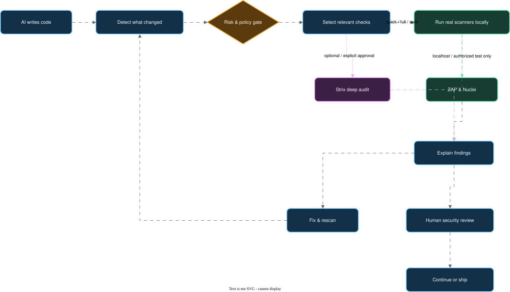

# Vibe Code Guard

**A local-first security orchestration layer, pipeline, and Dashboard for AI-assisted software.**

`v0.1.0-alpha` · Early Alpha / Active Development · macOS tested

> AI can produce code in seconds. Security review should not become the bottleneck—or disappear from the workflow.

<p align="center">
  
</p>

Animation fallback: [view the GIF version](diagrams/vibe-code-guard-overview.gif).

## What this project is

Vibe Code Guard combines the capabilities of established open-source security
tools into one understandable local workflow for AI-generated and
“vibe-coded” projects.

It is not another scanner and it does not replace the upstream projects. It is
the layer around them that:

1. understands what changed in a repository;
2. classifies the change and applies safe scanning policies;
3. selects the relevant checks instead of blindly running everything every time;
4. executes independently installed upstream tools;
5. collects execution evidence, findings, and skip reasons; and
6. presents the result in a local Dashboard with history and a conservative
   release-gate summary.

The goal is simple: install the security toolkit once, then use the same
repeatable security workflow in every AI-assisted coding repository.

## The problem we solve

AI-assisted development makes it easy to create features quickly, but it also
creates a practical security gap:

- **Security tools are fragmented.** Each scanner has its own installation,
  command syntax, output format, database, rules, and update process.
- **Developers do not know which check fits the change.** A dependency change,
  API change, secret leak, Dockerfile, and web application need different kinds
  of review.
- **Running every scanner on every edit is slow.** Running none of them leaves
  blind spots.
- **Raw findings are difficult to act on.** A list of tool-specific alerts does
  not clearly show what ran, what was skipped, what matters, or whether a fix
  actually remained fixed.
- **Active testing needs a boundary.** Web scanners and agentic testing tools
  must not accidentally target third-party systems.
- **Toolchain health is easy to forget.** An outdated binary, missing database,
  broken rule set, or failed self-test can make a security workflow look more
  complete than it really is.

Vibe Code Guard turns those separate concerns into one visible, local, and
repeatable security path.

## What we built

### 1. A curated open-source security toolkit

The core toolkit covers several independent detection layers:

| Security layer | Open-source tool | What it contributes | License |
| --- | --- | --- | --- |
| Secrets | [Gitleaks](https://github.com/gitleaks/gitleaks) | Detects likely secrets in source and Git history | [MIT](https://raw.githubusercontent.com/gitleaks/gitleaks/master/LICENSE) |
| Secrets | [TruffleHog](https://github.com/trufflesecurity/trufflehog) | Searches for credentials and verifies exposed secrets where supported | [AGPL-3.0](https://raw.githubusercontent.com/trufflesecurity/trufflehog/main/LICENSE) |
| Static analysis | [Semgrep](https://github.com/semgrep/semgrep) | Finds insecure code patterns using configurable rules | [LGPL-2.1](https://raw.githubusercontent.com/semgrep/semgrep/develop/LICENSE) |
| Vulnerabilities and config | [Trivy](https://github.com/aquasecurity/trivy) | Scans dependencies, filesystems, containers, secrets, and configuration | [Apache-2.0](https://raw.githubusercontent.com/aquasecurity/trivy/main/LICENSE) |
| Dependencies | [OSV-Scanner](https://github.com/google/osv-scanner) | Matches supported dependency manifests and lockfiles to OSV vulnerabilities | [Apache-2.0](https://raw.githubusercontent.com/google/osv-scanner/main/LICENSE) |
| Infrastructure as code | [Checkov](https://github.com/bridgecrewio/checkov) | Checks Terraform, Dockerfiles, Kubernetes, and other IaC policies | [Apache-2.0](https://raw.githubusercontent.com/bridgecrewio/checkov/main/LICENSE) |
| Authorized web testing | [OWASP ZAP](https://github.com/zaproxy/zaproxy) | Dynamic web application testing for authorized local/test targets | [Apache-2.0](https://raw.githubusercontent.com/zaproxy/zaproxy/main/LICENSE) |
| Authorized template detection | [Nuclei](https://github.com/projectdiscovery/nuclei) | Template-driven detection against explicitly authorized targets | [MIT](https://raw.githubusercontent.com/projectdiscovery/nuclei/main/LICENSE.md) |
| Optional agentic testing | [Strix](https://github.com/usestrix/strix) | Explicitly authorized deep testing and exploit validation | [Apache-2.0](https://raw.githubusercontent.com/usestrix/strix/main/LICENSE) |

Strix is not part of the deterministic eight-tool core health gate and is
never invoked implicitly by `quick` or `full`.

This is **composition at the workflow layer**, not a combined binary or a
fork. The repository does not copy, bundle, modify, or redistribute the
upstream scanners, their binaries, databases, rules, templates, or add-ons.
Users install and manage those projects through their own official channels.

### 2. A change-aware security pipeline

The pipeline separates everyday development checks from deeper pre-release
review:

```text
repository change
       ↓
detect files, stack, and risk
       ↓
apply policy and choose relevant checks
       ↓
run local upstream scanners
       ↓
normalize execution state and explain findings
       ↓
fix → regression test → targeted rescan
       ↓
human review and conservative release gate
```

The intended operating pattern is:

| Moment | Command | Typical scope |
| --- | --- | --- |
| During development | `security-check quick .` | Secrets, static analysis, and dependency checks |
| Before release | `security-check full .` | Broader code, dependency, and infrastructure checks |
| For a changed project | `security-check auto .` | Change-aware selection with an explanation for every run or skip |

**Full installation does not mean full scanning on every edit.** The toolkit
can be installed once globally, while the pipeline chooses a proportionate set
of checks for the current change.

### 3. A local security Dashboard

The Dashboard gives developers a visual audit trail instead of forcing them to
read several unrelated terminal outputs. It shows:

- which scanners actually ran;
- installed tool and toolchain health;
- findings and their evidence;
- explicit skip and not-applicable reasons;
- scan history and verified fixes after a later rescan; and
- a conservative release-gate summary.

The Dashboard is local-only by default. It binds to `127.0.0.1`, does not
require an account or cloud database, and does not upload source code or scan
results. It observes and explains scanner execution; it does not manufacture
findings or pretend that a skipped check passed.

## How to use it

### Install the external toolkit

The repository does not silently install scanners. Use each upstream project's
official installation instructions. A typical macOS setup for commonly
available CLI packages is:

```bash
brew install gitleaks trufflehog semgrep trivy osv-scanner nuclei
brew install --cask owasp-zap
```

Install Checkov using its official Python packaging instructions, preferably in
an isolated `pipx` environment. Then verify the toolkit:

```bash
security-tools doctor
security-tools self-test
```

### Install this orchestration layer

```bash
git clone https://github.com/DOTfei/vibe-code-guard
cd vibe-code-guard
npm install
npm test
npm run install:orchestrator
```

The installer copies only this project's orchestration modules to
`$SECURITY_TOOLKIT_HOME/orchestrator` (default:
`$HOME/security-toolkit/orchestrator`). It does not install scanners,
templates, databases, credentials, or binaries.

Then, inside any repository you are authorized to review:

```bash
security-check quick .
# or
security-check full .
# or
security-check auto .
```

### Start the local Dashboard

```bash
npm start
```

Open [http://127.0.0.1:4567](http://127.0.0.1:4567).

Optional configuration:

```bash
PORT=4567
SECURITY_TOOLKIT_HOME="$HOME/security-toolkit"
SECURITY_DASHBOARD_DATA_DIR="$HOME/security-toolkit/runs"
SECURITY_TOOL_PATHS="$HOME/bin"
SECURITY_TOOL_BINARIES='{"zap":"/path/to/zap.sh"}'
```

## Safety boundaries

No scanner or combination of scanners can guarantee that software is
vulnerability-free. Vibe Code Guard is an early-alpha engineering aid, not a
security warranty, certification, or substitute for qualified human review.

Active testing is restricted by design:

- ZAP and Nuclei default to localhost, local Docker, or explicitly configured
  authorized test/staging targets.
- Strix requires an explicit decision about the target, command, Docker, and
  any external LLM data flow.
- Never scan a third-party system without clear authorization.
- Never use real credentials or destructive payloads in self-tests.
- Nuclei templates and other executable security content must come from trusted
  sources and retain their security/signature controls.

External scanners may contact upstream services for vulnerability databases,
rules, templates, or add-ons. Review their individual network behavior and
terms for your environment.

## Licensing, attribution, and third-party terms

The original orchestration, Dashboard, policy, test, and documentation code in
this repository is licensed under the [Apache License 2.0](LICENSE).

The scanners listed above remain separate works owned by their respective
authors and organizations. Their licenses are **not** replaced by this
repository's Apache-2.0 license. The current integration invokes independently
installed tools through explicit adapters and allowlists; it does not link
against or redistribute their code or binaries.

For every integrated upstream project, the repository records:

- project name and official repository;
- license identifier and upstream license URL;
- integration boundary;
- whether the project is bundled or modified; and
- attribution and notice requirements.

See [`THIRD_PARTY_NOTICES.md`](THIRD_PARTY_NOTICES.md) for the human-readable
notice and license table, [`ATTRIBUTIONS.md`](ATTRIBUTIONS.md) for project
credits, [`third-party/tools.json`](third-party/tools.json) for portable
machine-readable metadata, and
[`security-toolchain.lock`](security-toolchain.lock) for the tracked toolchain
record.

Important licensing boundary: TruffleHog is AGPL-3.0 and Semgrep is LGPL-2.1.
If this project ever bundles, links to, modifies, embeds, packages, or
redistributes any upstream tool, rule, template, database, add-on, or
dependency, the licensing analysis must be repeated and the applicable notices
must be shipped. Do not assume that a tool's repository license covers every
artifact it downloads or uses.

The README architecture diagram was exported with
[Next AI Draw.io](https://github.com/DayuanJiang/next-ai-draw-io), which is an
external documentation tool and is licensed under
[Apache-2.0](https://raw.githubusercontent.com/DayuanJiang/next-ai-draw-io/main/LICENSE).
Its source code, binary, and runtime are not bundled or used by the Dashboard.

This documentation is a compliance record and is not legal advice. Before
distributing a combined binary, installer, container image, hosted service, or
commercial product, obtain a proper license and trademark review and check the
current upstream notices. Keep upstream copyright, trademark, and license
notices intact.

## What is complete—and what is not

Current early-alpha capabilities:

- deterministic change detection, risk classification, policy evaluation, and
  tool selection;
- `quick`, `full`, and change-aware `auto` plans;
- local Dashboard with execution state, findings, history, and tool health;
- localhost-focused active-testing boundaries; and
- safe synthetic self-test fixtures.

Planned milestones, not current promises:

- **v0.2 — Unified Findings:** richer normalized finding schema;
- **v0.3 — Correlation + Coverage:** cross-tool deduplication and coverage;
- **v0.4 — AI Fix Loop:** controlled fix, regression test, and targeted rescan;
- **v0.5 — Quality + Reliability:** lint, typecheck, build, and test signals;
- **v1.0 — Stable release:** after broader testing, review, and documentation.

## Editable architecture diagrams

- [Compact overview GIF](diagrams/vibe-code-guard-overview.gif) ·
  [Mermaid](diagrams/vibe-code-guard-overview.mmd) ·
  [Excalidraw](diagrams/vibe-code-guard-overview.excalidraw)
- [Detailed flow GIF](diagrams/vibe-code-guard-flow.gif) ·
  [Next AI Draw.io animated SVG](diagrams/vibe-code-guard-flow-next-ai-drawio.svg) ·
  [draw.io source](diagrams/vibe-code-guard-flow.drawio) ·
  [Mermaid](diagrams/vibe-code-guard-flow.mmd) ·
  [Excalidraw](diagrams/vibe-code-guard-flow.excalidraw)

The diagrams describe this repository's own architecture. The draw.io source
can be refined with [Next AI Draw.io](https://github.com/DayuanJiang/next-ai-draw-io);
no upstream source code, binary, or runtime dependency is bundled here.

## Repository layout

```text
orchestrator/       change detection, policy, risk, and tool selection
public/             local Dashboard assets
test/               unit tests and safe orchestration fixtures
scripts/            installation helpers
third-party/        portable upstream integration metadata
```

The repository intentionally does not contain scanner binaries, vulnerability
databases, secret rules, Nuclei templates, ZAP sessions, credentials, or
private project data.

## Contributing and security reports

See [`CONTRIBUTING.md`](CONTRIBUTING.md) for development expectations and
[`SECURITY.md`](SECURITY.md) for private vulnerability reporting. Please do
not publish credentials, sensitive logs, private source, or exploit details in
public issues.

## Project license

Original code in this repository: [Apache License 2.0](LICENSE).

Third-party projects and artifacts: separate upstream licenses and notices as
described above. Vibe Code Guard does not claim authorship of, or ownership
over, those projects.
