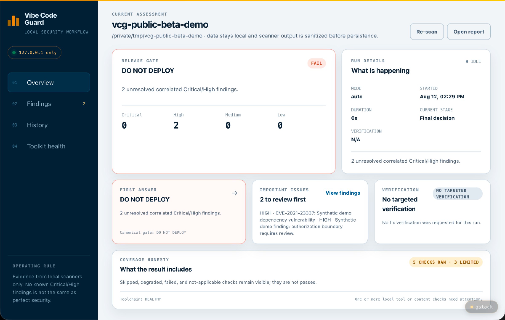
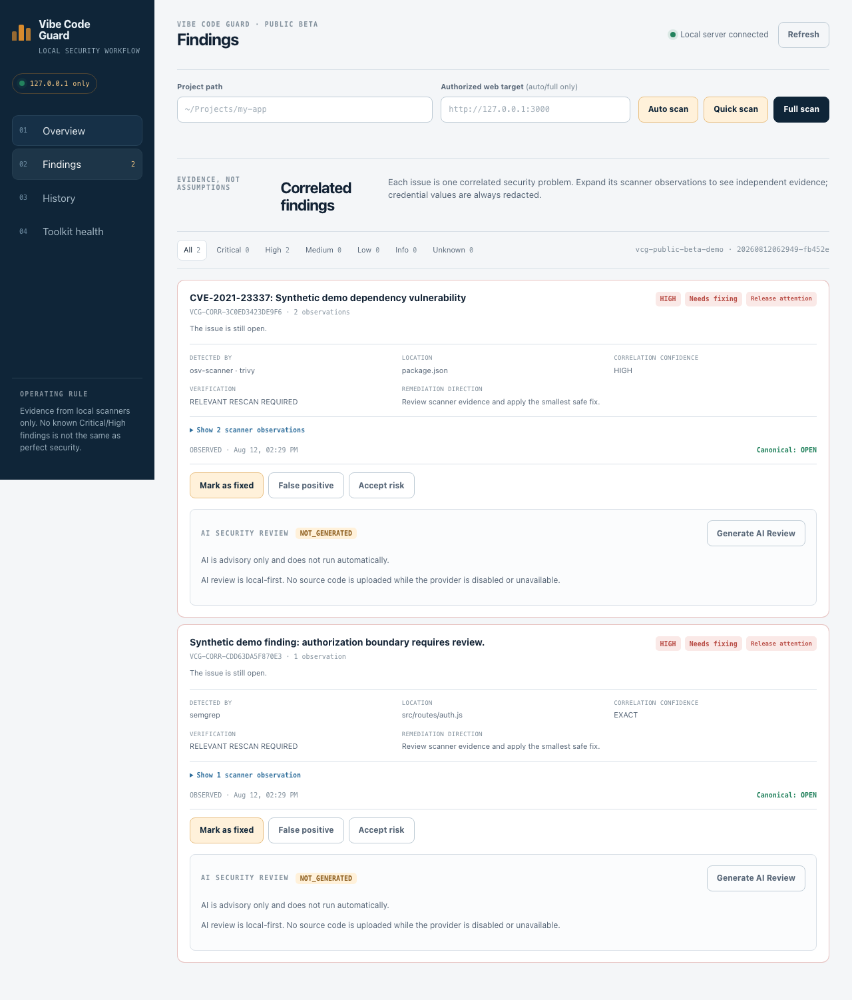
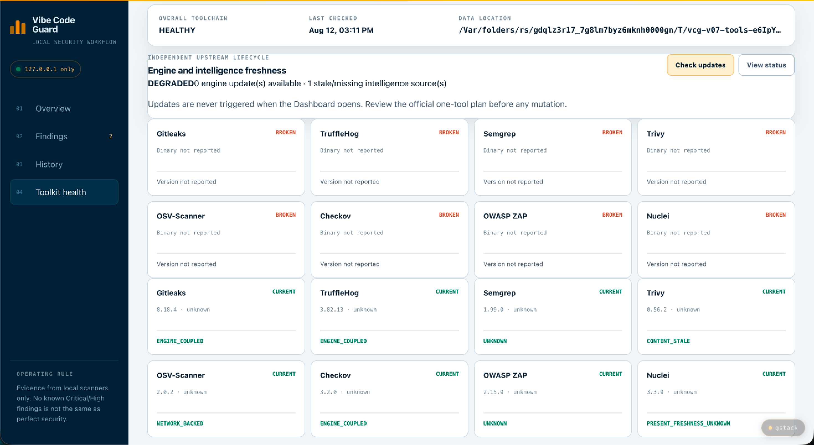
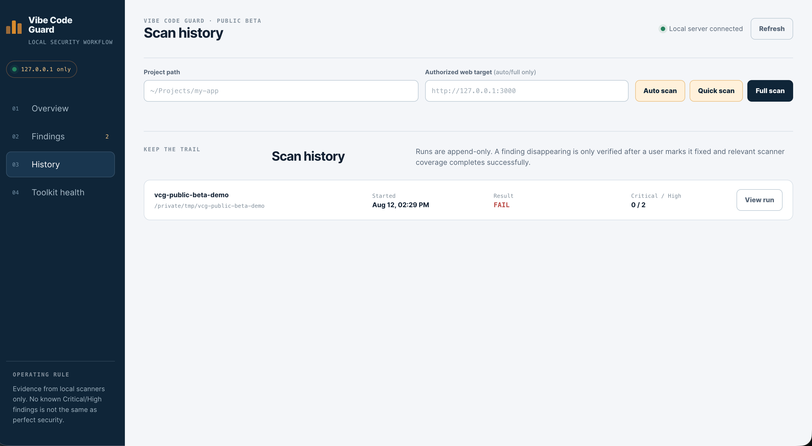

# Vibe Code Guard

**Public Beta**

### Security workflow for AI coding agents and vibe coders

AI can write an app in minutes. But when Codex, Claude Code, Cursor, or
another coding agent changes authentication, dependencies, APIs, secrets,
Docker configuration, or infrastructure, one practical question remains:

> **Which security checks should run, and is the result complete enough to review?**

Vibe Code Guard turns independently installed open-source scanners into one
local workflow that coding agents can understand and normal users can follow.

**AI writes the code. Vibe Code Guard makes sure the security workflow does
not get skipped.**

The scanners provide detection engines. Vibe Code Guard provides the layer
around them: project-aware selection, normalized findings, correlation,
lifecycle, targeted verification, coverage awareness, release decisions, and
human-facing Dashboard plus machine-readable CLI/JSON output.

## Quick Start

Give your coding agent this repository and paste:

```text
Install Vibe Code Guard from
https://github.com/DOTfei/vibe-code-guard
and security audit this project.
```

The agent can install or check Vibe Code Guard, choose the relevant checks,
run the audit, explain the result, and open the Dashboard. You do not need to
learn when to run Semgrep, Trivy, Gitleaks, Checkov, or the other supported
tools. If a required scanner is missing, Vibe Code Guard provides a fixed
official-source installation plan; the coding agent must obtain authorization
before installing a third-party tool.



_The overview brings the release decision, important findings, verification
state, and security coverage together._

## How it works



_Workflow diagram: the upstream scanners provide detection engines; Vibe Code
Guard provides the local orchestration, evidence model, lifecycle, and release
workflow._

<details>
<summary>Open the editable diagram sources</summary>

[Mermaid](diagrams/vibe-code-guard-public-beta-workflow.mmd) ·
[Excalidraw](diagrams/vibe-code-guard-public-beta-workflow.excalidraw) ·
[PNG](diagrams/vibe-code-guard-public-beta-workflow.png)

</details>

Humans use the Dashboard. Coding agents use the CLI and JSON output. Both read
the same findings, lifecycle, verification, scanner status, and release gate.

| Who | What they do |
| --- | --- |
| **Codex / Claude Code** | Understand the project, explain evidence, and make an authorized fix. |
| **Vibe Code Guard** | Select relevant checks, orchestrate the workflow, correlate findings, track verification, and calculate the release gate. |
| **Upstream scanners** | Provide the actual detection engines for secrets, code, dependencies, IaC, and authorized runtime checks. |

## Why Vibe Code Guard exists

Vibe coding makes software creation faster, but it also leaves many developers
with questions they should not have to answer by memorizing eight security
tools:

- Did the AI-generated change introduce a security problem?
- Which scanner fits this change?
- Did several scanners report the same underlying issue?
- Did an AI-claimed fix actually work?
- Did a scanner fail, or was it simply not applicable?
- Does incomplete coverage change the release decision?

Vibe Code Guard turns those questions into a visible, repeatable workflow.

| Developer problem | Vibe Code Guard response |
| --- | --- |
| “I do not know which security tool to run.” | Project- and change-aware scanner selection |
| “Eight tools return eight different formats.” | Unified Findings |
| “Several scanners reported the same issue.” | Cross-tool correlation and deduplication |
| “My coding agent says it fixed the bug.” | Targeted verification with relevant scanner coverage |
| “A failed scanner looks like zero findings.” | Explicit coverage, skipped, degraded, and failed states |
| “Can I release this?” | Conservative release gate and clear release state |
| “I cannot interpret raw scanner output.” | Human Dashboard plus CLI/JSON for agents |

## More than a scanner launcher

The eight scanners are important, but they are not the product by themselves.
Vibe Code Guard adds the workflow that makes specialized tools usable together:

1. **Project-aware selection** — chooses relevant checks from the stack, files,
   project type, profile, and runtime-target applicability.
2. **Unified Findings** — normalizes different scanner formats into one common
   finding model with stable evidence and fingerprints.
3. **Correlation** — groups compatible observations of the same underlying
   issue instead of making duplicate alerts look like separate vulnerabilities.
4. **Lifecycle** — records `OPEN`, `FIXING`, `FIXED`, `VERIFIED`, `REOPENED`,
   `FALSE_POSITIVE`, and `ACCEPTED_RISK` explicitly.
5. **Targeted verification** — reruns the relevant checks after an authorized
   fix instead of treating a code edit as proof.
6. **Coverage awareness** — keeps skipped, failed, degraded, and not-applicable
   checks visible; they are not silently converted into clean results.
7. **Release decision** — summarizes the canonical state as `SAFE TO DEPLOY`,
   `DO NOT DEPLOY`, `REVIEW REQUIRED`, or `INCOMPLETE SECURITY COVERAGE`.

Humans use the Dashboard. Coding agents use CLI/JSON. Both consume the same
canonical findings, lifecycle, verification, scanner status, and release gate.

## Eight independent security tools, one workflow

These are the eight supported Public Beta scanner integrations. Vibe Code Guard
does not run every scanner on every project; it selects tools based on project
applicability and audit profile.

| Tool | Security role | When VCG may use it | Upstream license |
| --- | --- | --- | --- |
| [Gitleaks](https://github.com/gitleaks/gitleaks) | Secret detection | Secret-sensitive changes and routine secret checks | [MIT](https://raw.githubusercontent.com/gitleaks/gitleaks/master/LICENSE) |
| [TruffleHog](https://github.com/trufflesecurity/trufflehog) | Secret discovery and verification where supported | Higher-risk secret checks and targeted verification | [GNU AGPL v3 — upstream LICENSE](https://raw.githubusercontent.com/trufflesecurity/trufflehog/main/LICENSE) |
| [Semgrep](https://github.com/semgrep/semgrep) | Static analysis | Source-code and policy-relevant changes | [LGPL-2.1](https://raw.githubusercontent.com/semgrep/semgrep/develop/LICENSE) |
| [Trivy](https://github.com/aquasecurity/trivy) | Dependencies, containers, configuration, and vulnerability data | Dependency, container, or configuration changes | [Apache-2.0](https://raw.githubusercontent.com/aquasecurity/trivy/main/LICENSE) |
| [OSV-Scanner](https://github.com/google/osv-scanner) | Dependency vulnerability intelligence | Supported manifest and lockfile changes | [Apache-2.0](https://raw.githubusercontent.com/google/osv-scanner/main/LICENSE) |
| [Checkov](https://github.com/bridgecrewio/checkov) | Infrastructure-as-code and configuration policy | Terraform, Dockerfile, Kubernetes, and related IaC changes | [Apache-2.0](https://raw.githubusercontent.com/bridgecrewio/checkov/main/LICENSE) |
| [OWASP ZAP](https://github.com/zaproxy/zaproxy) | Authorized dynamic web testing | Only when runtime scanning is required and scope is authorized | [Apache-2.0](https://raw.githubusercontent.com/zaproxy/zaproxy/main/LICENSE) |
| [Nuclei](https://github.com/projectdiscovery/nuclei) | Authorized template-based runtime detection | Only for an authorized localhost, local Docker, or test target | [MIT](https://raw.githubusercontent.com/projectdiscovery/nuclei/main/LICENSE.md) |

**Nuclei Templates are detection content, not a ninth scanner.** They are a
separate upstream repository with their own content and license lifecycle and
must be sourced from trusted official channels.

**Strix is not part of the Public Beta core eight or the normal deterministic
workflow.** Any optional or future agentic testing must remain explicitly
authorized and separately reviewed; it is not counted in this table.

## Third-party tools and licenses

Vibe Code Guard itself is licensed under Apache-2.0. The supported scanners
remain independent third-party projects; their licenses are not replaced by
the VCG license. VCG integrates with and invokes independently installed tools
through supported interfaces. It does not bundle, copy, modify, relicense, or
claim ownership of their upstream source code.

VCG may provide compatibility checks and an official-source installation plan,
but scanner versions and scanner update lifecycles remain separate from the
VCG version. Rule packs, templates, vulnerability databases, plugins,
add-ons, and other downloaded artifacts may have their own terms and must be
reviewed separately.

See [`THIRD_PARTY_NOTICES.md`](THIRD_PARTY_NOTICES.md) for detailed attribution
and license records. Vibe Code Guard is not affiliated with or endorsed by the
upstream projects unless explicitly stated otherwise.

## Installation model

VCG does not need to contain scanner source code to orchestrate scanner
executables that are installed independently.

```text
Install Vibe Code Guard
          ↓
VCG doctor
          ↓
Check independent security tools
          ↓
   ┌──────────────────────┬──────────────────────┐
   │ installed + compatible│ missing or degraded  │
   │ reuse                  │ official install plan│
   └──────────┬───────────┴──────────┬───────────┘
              ↓                      ↓
             reuse             user authorization
                                     ↓
                            independent installation
              └──────────────┬───────────────┘
                             ↓
                            audit
```

The VCG version and scanner versions are separate. VCG maintains compatibility
policy and lifecycle checks; it does not silently update third-party scanners.

## How VCG runs the pipeline

The pipeline separates everyday development checks from deeper pre-release
review:

```text
repository change
       ↓
detect files, stack, and risk
       ↓
apply policy and choose relevant checks
       ↓
run local upstream scanners
       ↓
parse the current run and explain findings
       ↓
record execution state and run history
       ↓
fix authorized by user → targeted rescan → lifecycle verification
       ↓
human review and conservative release gate
```

The intended operating pattern is:

| Moment | Command | Typical scope |
| --- | --- | --- |
| During development | `vibe-code-guard audit . --profile quick` | Secrets, static analysis, and dependency checks |
| Before release | `vibe-code-guard audit . --profile release` | Broader code, dependency, infrastructure, and authorized runtime checks |
| For a changed project | `vibe-code-guard audit . --profile auto` | Change-aware selection with an explanation for every run or skip |

**Full installation does not mean full scanning on every edit.** The toolkit
can be installed once globally, while the pipeline chooses a proportionate set
of checks for the current change.

## Findings, verification, and the Dashboard

After an authorized fix, the lifecycle is explicit:

```text
OPEN
  ↓
Coding agent makes an authorized fix
  ↓
FIXED
  ↓
Relevant scanners run again
  ↓
VERIFIED
```

**`FIXED` is not `VERIFIED`.** A code change alone does not make a finding
verified. If relevant scanner coverage is skipped, fails, degraded, out of
scope, or incomplete, VCG reports `VERIFICATION_INCOMPLETE` rather than a
false success. A finding can return as `REOPENED` or `STILL_DETECTED`.

The Dashboard is the human-facing view of the same canonical security state
consumed by coding agents through CLI/JSON. It shows:

- which scanners actually ran;
- installed tool and toolchain health;
- findings and their evidence;
- explicit skip and not-applicable reasons;
- scan history and current run/rescan evidence; and
- a conservative release-gate summary.

The current Dashboard reads the v1 Unified Finding Schema and presents
correlated issues with scanner observations and explicit lifecycle actions. It
does not automatically fix code; after an authorized external-agent fix it can
run a targeted rescan and report `VERIFIED`, `STILL_DETECTED`, or
`VERIFICATION_INCOMPLETE`. See the [Unified
Finding Schema documentation](docs/unified-finding-schema.md) and [correlation
and lifecycle documentation](docs/correlation-and-lifecycle.md) for the field
contracts and compatibility rules.



_The Findings view keeps the correlated issue and the independent scanner
observations visible together._



_Toolkit health keeps scanner readiness, freshness, and degraded states visible
instead of hiding them behind a green result._



_History keeps previous runs available so a fix and its later verification can
be reviewed as part of the same local record._

The Dashboard is local-only by default. It binds to `127.0.0.1`, does not
require an account or cloud database, and does not upload source code or scan
results. It observes and explains scanner execution; it does not manufacture
findings or pretend that a skipped check passed. v0.4 adds an optional,
explicitly triggered AI Security Review that explains selected redacted
Correlated Finding context; it remains advisory and cannot change deterministic
security state. See [AI Security Review documentation](docs/ai-security-review.md).

The Dashboard's first screen answers the human questions first: can this
project be deployed according to the canonical gate, which issues need
attention, whether a fix was actually verified, and whether scanner coverage
is degraded. Technical scanner observations remain available in the Findings
and Toolkit views. A clean result means no current release-blocking findings
were detected by the checks that ran; it is not a security guarantee.

## Public Beta limitations

Vibe Code Guard does not guarantee that software is secure or that every issue
will be detected. Runtime scanners require an authorized localhost, local
Docker, or explicitly authorized test target. External scanner databases,
rules, templates, and add-ons may be unavailable or degraded. A clean result
means only that no current release-blocking findings were detected by the
checks that completed; it is not a security guarantee or certification.

See [`AGENTS.md`](AGENTS.md) and
[`docs/agent-integration.md`](docs/agent-integration.md) for the canonical
agent workflow and JSON contracts. The [Public Beta demo](docs/public-beta-demo.md)
uses safe temporary projects and mock scanners.

## How to use it

### Install with one safe entrypoint

```bash
git clone https://github.com/DOTfei/vibe-code-guard
cd vibe-code-guard
npm install
npm test
./install.sh --dry-run
./install.sh --yes
```

The installer checks existing independently installed scanners, plans missing
supported dependencies through official channels, preserves healthy tools, and
never changes shell startup files or disables operating-system security
controls. It does not bundle or relicense scanners.

Then verify and audit the authorized project:

```bash
vibe-code-guard doctor --json
vibe-code-guard tools status --json
vibe-code-guard audit . --profile auto --json
vibe-code-guard dashboard --json
```

After the coding agent has made an authorized fix:

```bash
vibe-code-guard verify VCG-CORR-... . --json
```

For upstream tool maintenance, use the explicit lifecycle workflow:

```bash
vibe-code-guard tools check-updates --json
vibe-code-guard tools update semgrep --dry-run --json
vibe-code-guard tools refresh-data trivy --dry-run --json
```

The audit command and Dashboard never silently upgrade the independently
installed scanners. See [`docs/tool-lifecycle.md`](docs/tool-lifecycle.md).

Use `quick`, `full`, or `release` when the agent or human needs an explicit
profile. See [`docs/installation.md`](docs/installation.md) for manual
fallback, status states, cross-platform support, update, and uninstall behavior.
If the launcher directory is not already on PATH, use the absolute entrypoint
reported by `./install.sh --yes`; the installer intentionally does not edit
shell startup files.

The existing global health commands remain available:

```bash
security-tools doctor
security-tools self-test --json
```

### Start the local Dashboard

```bash
npm start
```

Open [http://127.0.0.1:4567](http://127.0.0.1:4567).

Optional configuration:

```bash
PORT=4567
SECURITY_TOOLKIT_HOME="$HOME/security-toolkit"
SECURITY_DASHBOARD_DATA_DIR="$HOME/security-toolkit/runs"
SECURITY_TOOL_PATHS="$HOME/bin"
SECURITY_TOOL_BINARIES='{"zap":"/path/to/zap.sh"}'
```

AI review is disabled by default. For a deterministic local demonstration only,
enable the synthetic provider explicitly:

```bash
SECURITY_AI_PROVIDER=mock npm start
```

The safe CLI equivalent for reviewing an existing local run is:

```bash
npm run ai-review -- --run-dir "$SECURITY_DASHBOARD_DATA_DIR/<run-id>" --finding VCG-CORR-...
```

## Safety boundaries

No scanner or combination of scanners can guarantee that software is
vulnerability-free. Vibe Code Guard is a public-beta engineering aid, not a
security warranty, certification, or substitute for qualified human review.

Active testing is restricted by design:

- ZAP and Nuclei default to localhost, local Docker, or explicitly configured
  authorized test/staging targets.
- Strix requires an explicit decision about the target, command, Docker, and
  any external LLM data flow.
- Never scan a third-party system without clear authorization.
- Never use real credentials or destructive payloads in self-tests.
- Nuclei templates and other executable security content must come from trusted
  sources and retain their security/signature controls.

External scanners may contact upstream services for vulnerability databases,
rules, templates, or add-ons. Review their individual network behavior and
terms for your environment.

## Detailed licensing, attribution, and third-party terms

The original orchestration, Dashboard, policy, test, and documentation code in
this repository is licensed under the [Apache License 2.0](LICENSE).

The scanners listed above remain separate works owned by their respective
authors and organizations. Their licenses are **not** replaced by this
repository's Apache-2.0 license. The current workflow invokes independently
installed tools through explicit adapters and allowlists; it does not bundle or
modify their upstream source code or binaries. This repository does contain its
own adapters, configuration, synthetic test fixtures, and generated
documentation assets; those are project artifacts, not upstream scanner source.

The listed licenses apply to the upstream repositories themselves. Rule packs,
templates, vulnerability databases, plugins, add-ons, model assets, and other
downloaded artifacts may have their own terms and must be reviewed separately
before use or redistribution.

For every integrated upstream project, the repository records:

- project name and official repository;
- license identifier and upstream license URL;
- integration boundary;
- whether the project is bundled or modified; and
- attribution and notice requirements.

See [`THIRD_PARTY_NOTICES.md`](THIRD_PARTY_NOTICES.md) for the human-readable
notice and license table, [`ATTRIBUTIONS.md`](ATTRIBUTIONS.md) for project
credits, [`third-party/tools.json`](third-party/tools.json) for portable
machine-readable metadata, and
[`security-toolchain.lock`](security-toolchain.lock) for the tracked toolchain
record.

Important licensing boundary: TruffleHog is described here as “GNU AGPL v3 —
see upstream LICENSE” and Semgrep as LGPL-2.1.
If this project ever bundles, links to, modifies, embeds, packages, or
redistributes any upstream tool, rule, template, database, add-on, or
dependency, the licensing analysis must be repeated and the applicable notices
must be shipped. Do not assume that a tool's repository license covers every
artifact it downloads or uses.

The README architecture diagram was exported with
[Next AI Draw.io](https://github.com/DayuanJiang/next-ai-draw-io), which is an
external documentation tool and is licensed under
[Apache-2.0](https://raw.githubusercontent.com/DayuanJiang/next-ai-draw-io/main/LICENSE).
Its source code, binary, and runtime are not bundled or used by the Dashboard.

This documentation is a compliance record and is not legal advice. Before
distributing a combined binary, installer, container image, hosted service, or
commercial product, obtain a proper license and trademark review and check the
current upstream notices. Keep upstream copyright, trademark, and license
notices intact.

## What is complete—and what is not

Current public-beta capabilities:

- deterministic change detection, risk classification, policy evaluation, and
  tool selection;
- `quick`, `full`, and change-aware `auto` plans;
- v1 Unified Findings across the supported scanners, with redaction and stable
  fingerprints;
- normalized Dashboard and Markdown report presentation;
- scanner execution state, run history, and tool health;
- deterministic cross-scanner correlation, project-level observations, and
  explicit `OPEN` / `FIXING` / `FIXED` / `VERIFIED` / `REOPENED` / `FALSE_POSITIVE` /
  `ACCEPTED_RISK` lifecycle states;
- authorized external-agent fix → targeted rescan → `VERIFIED`,
  `STILL_DETECTED`, or `VERIFICATION_INCOMPLETE` results;
- localhost-focused active-testing boundaries; and
- safe synthetic self-test fixtures;
- advisory AI Security Review with provider abstraction, bounded redacted
  context, schema validation, local caching, and stale-review detection; it is
  optional and disabled by default; and
- agent-readable `AGENTS.md` / `CLAUDE.md` instructions, toolchain manifest,
  safe bootstrap states, structured doctor/audit output, project config,
  localhost Dashboard launch, and Vibe Code Guard-only update/uninstall paths;
- official-source upstream tool lifecycle status, installation provenance,
  engine/content separation, update plans, and offline-aware reporting.
- v0.7 synthetic fixture coverage for React/Vite, Node API, Python, Supabase-
  style, Docker, and Terraform projects; isolated Agent E2E tests; stable CLI
  JSON/exit contracts; scope-cheating regression coverage; and public-beta
  readiness documentation.

Planned milestones, not current promises:

- **v0.2 — Unified Findings:** one normalized schema for every scanner result ✅;
- **v0.3 — Correlation + Lifecycle:** cross-tool deduplication and
  open/fixed/verified/reopened tracking ✅;
- **v0.4 — AI Security Review:** plain-language explanation of what the
  scanners found, including likely false positives ✅;
- **v0.5 — Agent Integration:** Codex/Claude Code instructions, safe bootstrap,
  canonical audit, structured contracts, and manual fallback ✅;
- **v0.6 — Fix → Targeted Rescan → Verify + Tool Lifecycle:** authorized
  remediation verification and official-source engine/content lifecycle ✅;
- **v0.7 — Real-world Agent E2E + Release Hardening:** synthetic fixture matrix,
  isolated agent walkthroughs, Dashboard/verification validation, CLI contract
  checks, and release-readiness documentation ✅;
- **v0.8 — Dashboard UX + Public Beta Packaging:** clearer release, finding,
  verification, toolchain, onboarding, and safe demo surfaces ✅;
- **v0.9 — Optional Strix Deep Audit:** explicit, authorized agentic testing;
- **v1.0 — Stable Security Review Platform:** after broader testing, review,
  and documentation.

Vibe Code Guard's own scope remains the orchestration flow, not the scanners.
Every roadmap item above is a workflow or presentation layer on top of
independently maintained upstream projects.

## Product explainer and implementation diagrams

The Public Beta workflow diagram above is the main README visual. It shows the
division of responsibility between the coding agent, Vibe Code Guard, and the
upstream scanning engines, plus the workflow outputs users see.

- **Public Beta workflow:** [SVG](diagrams/vibe-code-guard-public-beta-workflow.svg) ·
  [Mermaid](diagrams/vibe-code-guard-public-beta-workflow.mmd) ·
  [Excalidraw](diagrams/vibe-code-guard-public-beta-workflow.excalidraw) ·
  [PNG](diagrams/vibe-code-guard-public-beta-workflow.png)

- **Detailed product explainer:** [Next AI Draw.io animated SVG](diagrams/vibe-code-guard-explainer-next-ai-drawio.svg) ·
  [draw.io source](diagrams/vibe-code-guard-explainer.drawio) ·
  [Mermaid](diagrams/vibe-code-guard-explainer.mmd) ·
  [Excalidraw](diagrams/vibe-code-guard-explainer.excalidraw) ·
  [Next AI Draw.io PNG export](diagrams/vibe-code-guard-explainer-next-ai-drawio.png) ·
  [Mermaid PNG render](diagrams/vibe-code-guard-explainer.png)

- **Detailed implementation flow:** [GIF](diagrams/vibe-code-guard-flow.gif) ·
  [Next AI Draw.io animated SVG](diagrams/vibe-code-guard-flow-next-ai-drawio.svg) ·
  [draw.io source](diagrams/vibe-code-guard-flow.drawio) ·
  [Mermaid](diagrams/vibe-code-guard-flow.mmd) ·
  [Excalidraw](diagrams/vibe-code-guard-flow.excalidraw)

The diagrams describe this repository's own architecture. The draw.io source
can be refined with [Next AI Draw.io](https://github.com/DayuanJiang/next-ai-draw-io);
no upstream source code, binary, or runtime dependency is bundled here.

## Repository layout

```text
bin/                agent-facing vibe-code-guard and security-check commands
config/             repository-controlled toolchain manifest
orchestrator/       change detection, policy, risk, and tool selection
core/findings/      Unified Finding schema, sanitization, fingerprints, adapters
core/agent/         installer, doctor, config, and structured agent contracts
public/             local Dashboard assets
docs/               schema, installation, and agent integration documentation
test/               unit tests and safe orchestration fixtures
scripts/            compatibility installation helpers
third-party/        portable upstream integration metadata
```

The repository intentionally does not contain scanner binaries, vulnerability
databases, secret rules, Nuclei templates, ZAP sessions, credentials, or
private project data.

## Contributing and security reports

See [`CONTRIBUTING.md`](CONTRIBUTING.md) for development expectations and
[`SECURITY.md`](SECURITY.md) for private vulnerability reporting. Please do
not publish credentials, sensitive logs, private source, or exploit details in
public issues.

## Project license

Original code in this repository: [Apache License 2.0](LICENSE).

Third-party projects and artifacts: separate upstream licenses and notices as
described above. Vibe Code Guard does not claim authorship of, or ownership
over, those projects.
